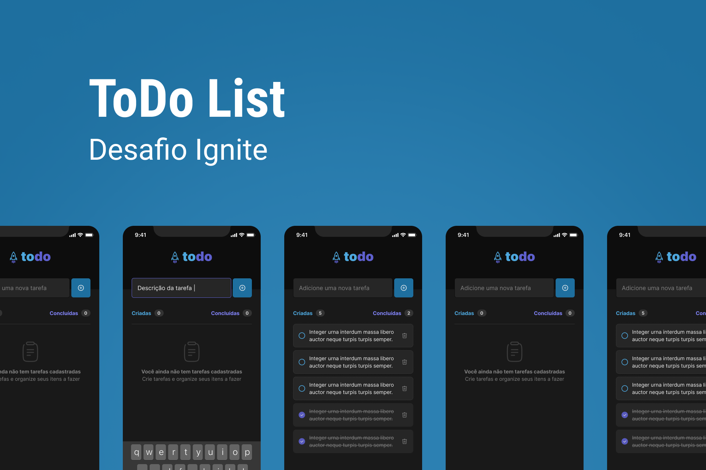

<h1 align="center">
  
</h1>
<p align="center">Desafio onde o seu principal objetivo é desenvolver uma aplicação de controle de tarefas no estilo to-do list.</p>


<p align="center">
 <a href="#sobre-o-projeto">Sobre o Projeto</a> •
 <a href="#tecnologias">Tecnologias</a> •
 <a href="#configurações-necessárias">Configurações necessárias</a>
</p>

## Sobre o projeto

O projeto tem como objetivo o estudo e desenvolvimento de uma aplicação de controle de tarefas no estilo **to-do list**, que contém as seguintes 

funcionalidades:

- Adicionar uma nova tarefa
- Marcar e desmarcar uma tarefa como concluída
- Remover uma tarefa da listagem
- Mostrar o progresso de conclusão das tarefas

O projeto foi desenvolvido como Desafio 01 - Praticando os conceitos do React Native [Ignite da Rocketseat](https://rocketseat.com.br/)

Link do >> [Desafio](https://efficient-sloth-d85.notion.site/Desafio-01-Praticando-os-conceitos-do-React-Native-f8f164e29df74cd987e1f9aebf142ffb)

---

## Tecnologias

Abaixo as tecnologias utilizadas para construção da aplicação

- [React Native](https://reactjs.org/)
- [Expo](https://docs.expo.dev)
- [TypeScript](https://www.typescriptlang.org)

---

## Configurações necessárias

### **Requisitos**

Necessário realizar as instalações:

- [Git](https://git-scm.com/)
- [npm](https://docs.npmjs.com/downloading-and-installing-node-js-and-npm)


### **Clone do projeto**

```bash
# Execute o comando git clone para realizar o clone do repositório
$ git clone https://github.com/diogomfc/React_Native-ToDo-List.git
# Entre na pasta do repositório clonado
$ cd react_native-todo-list
```

### **Iniciando o projeto**

```bash
# Execute npm para instalar as dependências
$ npm i

# Para iniciar a aplicação
$ npx expo start

# No Smartphone
Instale o App Expo Go no seu smartphone

Abra o aplicativo, clique em Digitalizar código QR e escaneie o que está sendo exibido no terminal.

```
